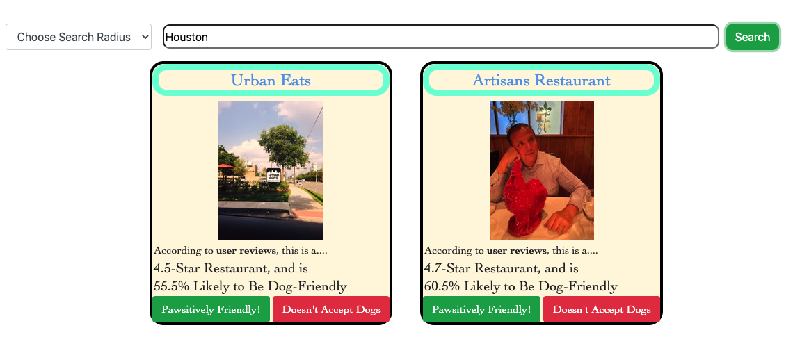

# **Dine-In Doggos**

Dine-In Doggos is a website built for dealing with the age-old question; Can we take our best buddy with us when we go out to our favorite restaurants? If your anything like us, you have often wondered what restaurants in your area allow Man's best friend to come with you? Then Dine-In Doggos is your site!

## **General**

Dine-In Doggos was built using the following technologies and libraries:
* Jquery
* Boostrap
* Ajax
* JSON
* JavaScript
* HTML
* CSS.

Our team members were: [Dasom Huber](https://github.com/DasomAnH), [Katherine Frain](https://github.com/katherfrain), and [Peter Looney](https://github.com/plooney81).


## **How it works**

Dine-In Doggoes uses Google Maps GeoCode API and Places JavaScript library to find nearby restaurants and present the user with restaurants that reviewers have said are dog or pet friendly. Each restaurant review returned by the Google Places Library is tested against a Regular Expression of Dog, animal, or Pet friendly. Each instance of a positive regular expression search for a Restaurant increases their chance of being a dog friendly and presented to the user by way of a beautiful render function.

```JavaScript
     if(regex.test(currentReview.text)){
        if (dogFriendlyRestaurants[place.name]){
            dogFriendlyRestaurants[place.name].frequency += 1;
        }else{
            dogFriendlyRestaurants[place.name] = {
                'restaurantName' : place.name, 
                'frequency': 1, 
                'rating': place.rating, 
                'reviews': place.reviews,
                'pic': '#'
            };
```


From here, users can vote on weather or not they agree with Dine-In Doggos by clicking either the Pawsitively Friendly button or the Doesn't Accept Dogs. These selections will be saved on the page 


## **How To Use**


API King: Pete Looney
Empress of Buttons: Kate Frain
CSS QUEEN: Dasom

-Pete wrote a function to utilize the Google Place API to allow users to search dog-friendly restaurants, isolating 'dog-friendly' by parsing reviews for keywords
-Kate integrated the API calls with our html via render strings
-Dasom made everything gorgeous via CSS
-Team members worked together to make Dog CEO API return random dog pictures if users submitted unsupported file types to the About Me section

-Apparently we need to give credit to font awesome for using their dog icon, and provide a link to their license. Below is an example of that:
Dog Icon: Font Awesome, all right reserved.
License: https://fontawesome.com/license